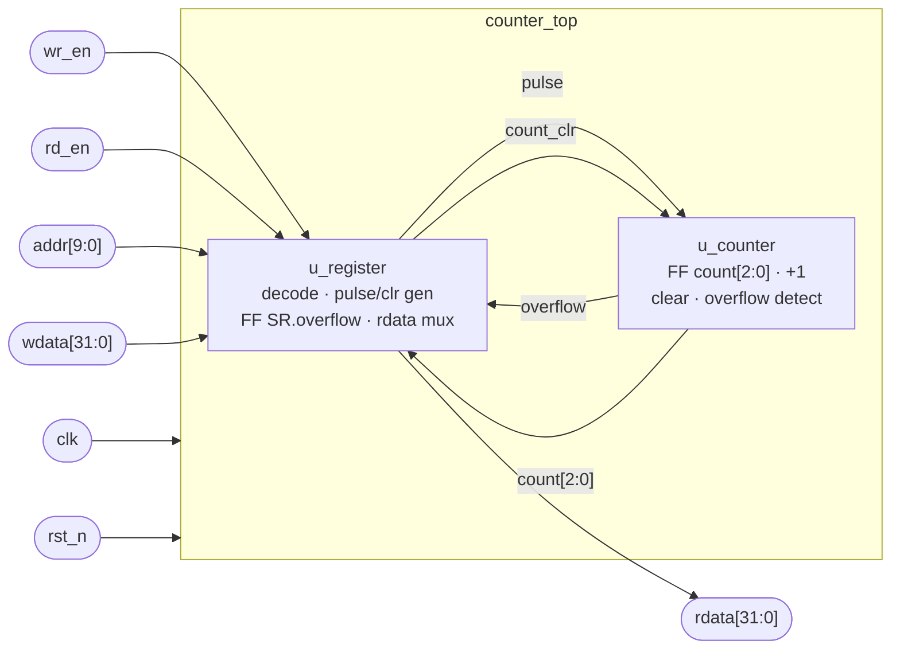

# `counter_top` — Design Proposal & Logic Diagram

> **Nguồn yêu cầu:** `ddoc/3-bit_pulse_counter_spec.md`
> **Plan:** `plans/2026-09-29-1905-counter-top-logic-diagram.md` (`PLAN-20260929-001`, type `DESIGN`)
> **Session:** `memory_bank/2026-09-29-1905-counter-top-logic-diagram.md`
> **Phạm vi tài liệu này:** sơ đồ khối + **sơ đồ logic đầy đủ tới mức gate / flip-flop**.
> **Rev 2 (2026-09-29):** theo yêu cầu của user, `SR.overflow` đổi sang **`clear` đè `set`** khi hai
> việc trùng cycle (Rev 1 là `set` đè `clear`). Ảnh hưởng: §2.3, §4.4, §7, §8, §9, §10 (O3).
> Tài liệu này **không** phải RTL và **không** sinh ra file `.v` nào — việc viết RTL thuộc plan
> `IMPLEMENT` sau. Các phương trình logic ở §7 là *chú thích của sơ đồ*, không phải code.

---

## 1. Mục tiêu và phạm vi

`counter_top` là bộ đếm xung 3-bit điều khiển qua CPU bus (CSR). Module gồm **2 sub-block**:

| Sub-block | Instance | Vai trò |
|---|---|---|
| `register` | `u_register` | Giải mã `addr`, tạo write strobe cho CR/SR, sinh `pulse` và `count_clr`, giữ flip-flop `SR.overflow`, ghép `rdata` |
| `counter` | `u_counter` | Flip-flop `count[2:0]`, bộ tăng 1 (incrementer), xoá đếm, phát hiện `overflow` |

Phân rã này **lấy nguyên** từ `spec.md` §Overview — tài liệu này không tự gộp hay tách khác đi.

---

## 2. Giao diện

### 2.1 Port top-level

| Port | Dir | Width | Mô tả |
|---|---|---|---|
| `clk` | in | 1 | Clock hệ thống, tích cực cạnh lên. Một clock domain duy nhất |
| `rst_n` | in | 1 | Reset **bất đồng bộ, active-low** |
| `wr_en` | in | 1 | Write enable, xung 1 cycle |
| `rd_en` | in | 1 | Read enable, xung 1 cycle |
| `addr[9:0]` | in | 10 | Địa chỉ thanh ghi |
| `wdata[31:0]` | in | 32 | Dữ liệu ghi |
| `rdata[31:0]` | out | 32 | Dữ liệu đọc |

### 2.2 Tín hiệu nội bộ (`register` ↔ `counter`)

| Signal | Chiều | Width | Loại | Mô tả |
|---|---|---|---|---|
| `pulse` | `u_register` → `u_counter` | 1 | tổ hợp, 1 cycle | Xung đếm, sinh khi ghi `1` vào `CR.pulse_en` |
| `count_clr` | `u_register` → `u_counter` | 1 | tổ hợp, 1 cycle | Xung xoá, sinh khi ghi `1` vào `CR.count_clr` |
| `overflow` | `u_counter` → `u_register` | 1 | tổ hợp, 1 cycle | Báo tràn: có `pulse` khi `count` đang là `3'b111` |
| `count[2:0]` | `u_counter` → `u_register` | 3 | ngõ ra flip-flop | Giá trị đếm hiện tại, phản ánh real-time vào `SR.cnt` |

### 2.3 Register map

| Addr | Name | Bits | Field | Access | Reset | Hành vi |
|---|---|---|---|---|---|---|
| `0x000` | `CR` | `[31:2]` | reserved | RO 0 | — | Đọc trả `0` |
| `0x000` | `CR` | `[1]` | `count_clr` | **W1P** (one-shot) | — | Ghi `1` → xoá counter về 0. Ghi `0` → **không** xoá. Đọc trả `0`. **Không có phần tử lưu** |
| `0x000` | `CR` | `[0]` | `pulse_en` | **WO** | — | Ghi `1` → sinh đúng 1 `pulse`. Đọc trả `0`. **Không có phần tử lưu** |
| `0x004` | `SR` | `[31:4]` | reserved | RO 0 | — | Đọc trả `0` |
| `0x004` | `SR` | `[3]` | `overflow` | **RW0C** | `0` | Set bởi `overflow`. Ghi `0` → clear; ghi `1` → không tác dụng. **Không tự clear**. Khi set và clear trùng cycle: **clear thắng**. Có **1 flip-flop** |
| `0x004` | `SR` | `[2:0]` | `cnt` | **RO** | `0` | Phản ánh trực tiếp `count[2:0]` (real-time, không qua flip-flop riêng) |

Tổng phần tử tuần tự toàn IP: **4 flip-flop** = 3 (`count[2:0]`) + 1 (`SR.overflow`).

---

## 3. Sơ đồ khối `counter_top`

```
                     ┌───────────────────────────── counter_top ─────────────────────────────┐
                     │                                                                        │
        clk ────────►├───────────────────┬────────────────────────────────┐                   │
      rst_n ────────►├───────────────────┼──────────────────┐             │                   │
                     │                   │                  │             │                   │
                     │   ┌───────────────▼──────────────────▼──┐   ┌──────▼──────────────┐    │
      wr_en ────────►├──►│                                     │   │                     │    │
      rd_en ────────►├──►│                                     │   │                     │    │
  addr[9:0] ────────►├──►│             u_register              │   │      u_counter      │    │
wdata[31:0] ────────►├──►│                                     │   │                     │    │
                     │   │  · decode CR/SR                     │   │  · FF count[2:0]    │    │
                     │   │  · pulse / count_clr generator      │   │  · incrementer +1   │    │
                     │   │  · FF SR.overflow (RW0C)            │   │  · clear            │    │
                     │   │  · rdata read mux                   │   │  · overflow detect  │    │
                     │   │                                     │   │                     │    │
                     │   │                    pulse (1) ───────┼──►│ pulse               │    │
                     │   │                count_clr (1) ───────┼──►│ count_clr           │    │
                     │   │                 overflow (1) ◄──────┼───┤ overflow            │    │
                     │   │               count[2:0] (3) ◄──────┼───┤ count[2:0]          │    │
                     │   └──────────────┬──────────────────────┘   └─────────────────────┘    │
                     │                  │ rdata[31:0]                                         │
rdata[31:0] ◄────────┤◄─────────────────┘                                                     │
                     └────────────────────────────────────────────────────────────────────────┘
```

Cùng nội dung ở dạng hierarchy:



---

## 4. Sơ đồ logic `u_register`

### 4.1 Giải mã địa chỉ và write strobe

```
                 ┌──────────────────────┐
  addr[9:0] ─┬──►│  CMP   addr == 0x000 │──── cr_sel ───┬─────────────────────────────►(4.2)(4.3)(4.5)
             │   └──────────────────────┘               │
             │                                          │      ┌───────┐
             │                                          └─────►│       │
             │                                   wr_en ───────►│  AND  │── cr_wr ──────►(4.2)(4.3)
             │                                                 │       │
             │                                                 └───────┘
             │   ┌──────────────────────┐
             └──►│  CMP   addr == 0x004 │──── sr_sel ───┬─────────────────────────────►(4.4)(4.5)
                 └──────────────────────┘               │
                                                        │      ┌───────┐
                                                        └─────►│       │
                                                 wr_en ───────►│  AND  │── sr_wr ──────►(4.4)
                                                               │       │
                                                               └───────┘
```

`CMP` là bộ so sánh 10-bit với hằng số (thực chất là một cây AND/NOR trên 10 bit `addr`).

### 4.2 Bộ sinh `pulse` — *"logic generating pulse from a write command"*

```
    wr_en ───────────────┐
                         │    ┌─────────┐
  cr_sel ────────────────┼───►│         │
 (addr==0x000)           └───►│   AND3  │──────► pulse ──────► u_counter
                              │         │
 wdata[0] ───────────────────►│         │
 (CR.pulse_en)                └─────────┘
```

**Đặc điểm quyết định:** đường này **thuần tổ hợp, không có flip-flop**. Vì vậy `pulse` rộng đúng
bằng độ rộng của `wr_en` (1 cycle), và `count` cập nhật ở **cạnh clock ngay sau** cycle có `wr_en` —
đúng như waveform mẫu trong `spec.md` §Appendix. Nếu chen một flip-flop ở đây, `count` sẽ trễ thêm
1 cycle và **lệch waveform mẫu**.

`CR.pulse_en` không có phần tử lưu ⇒ đọc `CR` luôn trả bit[0] = `0` (đúng access `WO`).

### 4.3 Bộ sinh `count_clr`

```
    wr_en ───────────────┐
                         │    ┌─────────┐
  cr_sel ────────────────┼───►│         │
 (addr==0x000)           └───►│   AND3  │──────► count_clr ──► u_counter
                              │         │
 wdata[1] ───────────────────►│         │
 (CR.count_clr)               └─────────┘
```

Cũng là **one-shot thuần tổ hợp, không flip-flop**: ghi `1` → sinh 1 xung xoá; ghi `0` → tín hiệu
bằng `0` ⇒ **không** xoá. Đọc `CR` trả bit[1] = `0`.

### 4.4 Flip-flop `SR.overflow` — *"logic for SR.overflow"* (RW0C)

```
                                     ┌──────────────────┐
             sr_wr ─────────────────►│                  │
         (wr_en & addr==0x004)       │       AND2       │── sr_ovf_clr ──────┐
         wdata[3] ──►o──────────────►│  (clear request) │                    │
          (ghi 0 ⇒ clear)            └──────────────────┘                    │
                                                                             │
                                                                             │
   overflow ─────────────────┐                                               │
   (từ u_counter)            │                                               │
                             ├────►┌──────────┐                              ▼ (đảo)
                             │     │          │                    ┌───────────────────┐
                             │     │   OR2    │── set_or_hold ────►│    AND2 + INV     │── sr_ovf_nxt ──┐
   sr_overflow ──────────────┼────►│          │                    │   (CLEAR đè SET)  │                │
    (hồi tiếp)               │     └──────────┘                    └───────────────────┘                │
                             │                                                                           │
                             │                       ┌───────────────────────────────────────────────────┘
                             │                       ▼
                             │             ┌─────────────────────┐
                             │             │ D              Q    │──── sr_overflow ──┬──►(4.5) SR[3]
                             │             │                     │                   │
                     clk ────┼────────────►│>                    │                   │
                             │             │                     │                   │
                   rst_n ────┼────────────►│o CLR_N  (async)     │                   │
                             │             └─────────────────────┘                   │
                             │                                                        │
                             └────────────────────────────────────────────────────────┘
                                          (hồi tiếp sr_overflow về OR2)
```

Rút gọn thành phương trình của **1 flip-flop duy nhất**:

```
sr_ovf_clr  = sr_wr & ~wdata[3]                // ghi 0 vào SR[3] ⇒ clear
set_or_hold = overflow | sr_overflow           // set mới, hoặc giữ mức cũ
sr_ovf_nxt  = set_or_hold & ~sr_ovf_clr        // CLEAR ĐÈ SET
```

Ba tính chất phải thấy được trên sơ đồ:

1. **Không có đường tự clear** — không có cổng nào kéo `sr_ovf_nxt` về 0 theo thời gian hay theo
   `pulse` kế tiếp. Bit chỉ về 0 bởi (a) `rst_n = 0`, hoặc (b) CPU ghi `0` vào `SR[3]`.
2. **Ghi `1` vào `SR[3]` không tác dụng**: khi `wdata[3] = 1` thì `sr_ovf_clr = 0` ⇒ bit giữ nguyên
   (đi qua nhánh hold của `OR2`).
3. **`clear` đè `set`** — `sr_ovf_clr` nằm ở **cổng cuối**, sau `OR2`, nên nó ép `sr_ovf_nxt = 0` bất
   kể `overflow` và `sr_overflow`. Hệ quả: nếu `overflow` và lệnh CPU ghi `0` xảy ra **cùng cycle**
   thì FF về `0` và **event overflow của cycle đó không được ghi nhận**. Đây là quyết định của user
   (2026-09-29): lệnh ghi của CPU luôn thắng. Spec không quy định trường hợp này.

Đặt `sr_ovf_clr` ở cổng cuối cũng làm mạch **nhỏ hơn** phương án "set đè clear": chỉ 1 `OR2` + 1
`AND2` có bubble, thay vì 1 `AND2` cho nhánh hold + 1 `OR2`.

### 4.5 Read mux `rdata[31:0]`

```
                                   ┌───────────────────────────────┐
                                   │  CR readback = 32'h0000_0000  │
  cr_sel ─────────────────────────►│  (bit[1] W1P, bit[0] WO,      │──┐
                                   │   bit[31:2] reserved)         │  │
                                   └───────────────────────────────┘  │
                                                                      │   ┌──────────────┐
                                   ┌───────────────────────────────┐  ├──►│              │
 sr_overflow ─────────────────────►│  SR readback =                │  │   │   MUX / OR   │
 count[2:0] ──────────────────────►│  { 28'h0, sr_overflow,        │──┤──►│   theo sel   │──┐
 (real-time từ u_counter)          │           count[2:0] }        │  │   │              │  │
                                   └───────────────────────────────┘  │   └──────────────┘  │
  sr_sel ──────────────────────────────────────────────────────────┬──┘                     │
                                                                   │                        │
                                  ┌────────────────────────────────┘                        │
                                  │  default = 32'h0 khi addr không khớp                    │
                                  └──────────────────────────────────────────────────────────┤
                                                                                             │
                                                   ┌──────────────┐                          │
                                    rd_en ────────►│  AND (gate)  │◄─────────────────────────┘
                                                   └──────┬───────┘
                                                          │
                                                          └────────► rdata[31:0]
```

Rút gọn:

```
rd_word   = cr_sel ? 32'h0
          : sr_sel ? {28'h0, sr_overflow, count[2:0]}
          :          32'h0
rdata     = rd_en ? rd_word : 32'h0
```

**Thuần tổ hợp, không flip-flop** ⇒ `rdata` hợp lệ **ngay trong cycle có `rd_en`**. `SR.cnt` lấy
trực tiếp `count[2:0]` từ `u_counter` nên là giá trị **real-time** (đúng yêu cầu spec: *"The current
counter value is always reflected (real-time, read-only) through SR.cnt[2:0]"*).

---

## 5. Sơ đồ logic `u_counter`

### 5.1 Datapath đếm: incrementer + mux next-state + flip-flop

```
                       ┌───────────────── incrementer +1 (3-bit) ─────────────────┐
                       │                                                          │
   count[0] ──►o───────┼──────────────────────────────────────► inc[0]            │
               INV     │                                                          │
                       │        ┌───────┐                                         │
   count[1] ───────────┼───────►│  XOR  │─────────────────────► inc[1]             │
   count[0] ───────────┼───────►│       │                                          │
                       │        └───────┘                                          │
                       │        ┌───────┐        ┌───────┐                         │
   count[1] ───────────┼───────►│  AND  │───c1──►│  XOR  │────► inc[2]             │
   count[0] ───────────┼───────►│       │        │       │                         │
                       │        └───────┘   count[2] ───►│       │                 │
                       │                                 └───────┘                 │
                       └──────────────────────────────────────────────────────────┘
                                             │ inc[2:0]
                                             ▼
                              ┌──────────────────────────────────┐
             count_clr ──────►│ sel0 (ƯU TIÊN CAO NHẤT) → 3'b000 │
                              │                                   │
                 pulse ──────►│ sel1                    → inc[2:0]│─── count_nxt[2:0] ──┐
                              │                                   │                      │
                              │ default                 → count   │                      │
                              └──────────────────────────────────┘                      │
                                             ▲                                           │
   count[2:0] (feedback) ────────────────────┘                                           │
                                                                                         ▼
                                                              ┌────────────────────────────────┐
                                                              │  D[2:0]            Q[2:0]      │── count[2:0] ──┬──► u_register
                                                     clk ────►│ >                              │                │  (SR.cnt)
                                                              │   FF × 3                       │                │
                                                   rst_n ────►│o CLR_N  (async, → 3'b000)      │                ├──►(5.2)
                                                              └────────────────────────────────┘                │
                                                                        ▲                                       │
                                                                        └───────────────────────────────────────┘
                                                                                   (feedback)
```

Phương trình:

```
count_nxt = count_clr ? 3'b000
          : pulse     ? (count + 3'b001)
          :              count
```

Hai điểm cần thấy rõ trên sơ đồ:

- **Ưu tiên `count_clr` > `pulse` > hold.** Khi CPU ghi `wdata[1:0] = 2'b11` (cả `count_clr` và
  `pulse_en`), nhánh `count_clr` thắng ⇒ `count` về `3'b000`.
- **Wrap-around, không saturate.** Bộ tăng chỉ giữ 3 bit, nên `3'b111 + 1 = 3'b000` một cách tự
  nhiên — **không có** cổng nào chặn việc đếm tại giá trị max. Đúng waveform mẫu `3'h7 → 3'h0`.

### 5.2 Bộ phát hiện `overflow`

```
   count[2] ───────►┌─────────┐
   count[1] ───────►│  AND3   │── cnt_max (count == 3'b111)
   count[0] ───────►│         │        │
                    └─────────┘        │
                                       │        ┌─────────┐
      pulse ──────────────────────────┼───────►│         │
                                       └───────►│  AND3   │───► overflow ───► u_register (4.4)
  count_clr ──►o──────────────────────────────►│         │
                INV                             └─────────┘
```

Phương trình:

```
cnt_max  = count[2] & count[1] & count[0]
overflow = pulse & ~count_clr & cnt_max
```

- `overflow` là **tổ hợp, rộng 1 cycle**, phát ra **cùng cycle** với `pulse` gây tràn. Vì `SR.overflow`
  là flip-flop (§4.4), giá trị đọc được qua `SR[3]` xuất hiện **trễ 1 cycle** — đúng waveform mẫu.
- `~count_clr` nhất quán với ưu tiên ở §5.1: nếu lệnh ghi đồng thời yêu cầu xoá thì không có việc
  tăng đếm, nên **không** tính là tràn.
- `overflow` do `u_counter` phát ra (không phải `u_register` tự suy), đúng chiều tín hiệu mà
  `spec.md` §Internal signals quy định.

---

## 6. Sơ đồ logic đầy đủ (mức phẳng, một hình)

```
                                                                    ┌──────────────── u_counter ─────────────────┐
  ┌──────────────────────── u_register ────────────────────────┐     │                                            │
  │                                                            │     │   ┌─────────────┐                          │
  │  addr[9:0]─┬─►[CMP =0x000]─cr_sel─┬──────────────┐         │     │   │ incrementer │                          │
  │            │                      │   [AND]──cr_wr──┐      │     │   │  count + 1  │──inc[2:0]──┐             │
  │            │              wr_en──►┘                 │      │     │   └──────▲──────┘            │             │
  │            │                                        │      │     │          │                   ▼             │
  │            │   wdata[0]───►[AND3]◄──cr_wr───────────┤      │     │          │        ┌──────────────────────┐  │
  │            │                 │                      │      │     │          │  clr──►│ 000  (ưu tiên 1)     │  │
  │            │                 └──── pulse ───────────┼──────┼─────┼──────────┼──pulse►│ inc  (ưu tiên 2)     │  │
  │            │                                        │      │     │          │        │ hold (default)       │  │
  │            │   wdata[1]───►[AND3]◄──cr_wr───────────┘      │     │          │        └──────────┬───────────┘  │
  │            │                 │                             │     │          │                   │ count_nxt    │
  │            │                 └──── count_clr ──────────────┼─────┼──────────┼───────────────────┼──────┐       │
  │            │                                               │     │          │                   ▼      │       │
  │            └─►[CMP =0x004]─sr_sel─┬──────────────┐          │     │          │      ┌──────────────────┐│       │
  │                                   │   [AND]──sr_wr─┐       │     │          └──────┤ FF × 3  count[2:0]││       │
  │                           wr_en──►┘                │       │     │  clk ──────────►│>                  ││       │
  │                                                    │       │     │  rst_n ────────►│o CLR_N (async)    ││       │
  │   wdata[3]──►o──►[AND2]◄───────────────────────────┘       │     │                 └─────────┬─────────┘│       │
  │                    │                                       │     │                           │          │       │
  │                    └── sr_ovf_clr ───────────────┐          │     │              count[2:0] ──┴──────────┘       │
  │                                              (đảo)│          │     │                   │  │                       │
  │                    sr_overflow ───┐               ▼          │     │                   │  └──►[AND3]──cnt_max     │
  │                                   ├─►[OR2]─►[AND2 : CLEAR đè]     │                   │            │             │
  │   overflow ───────────────────────┘             │            │     │      pulse ───────┼──►[AND3]◄──┘             │
  │       ▲                                        │            │     │  ~count_clr ──────┼──►  │                    │
  │       │                                        ▼            │     │                   │     └── overflow ────────┼──┐
  │       │                              ┌──────────────────┐   │     │                   │                          │  │
  │       │                              │ FF  sr_overflow  │   │     └──────────────────┼──────────────────────────┘  │
  │       │                     clk ────►│>                 │   │                        │                             │
  │       │                   rst_n ────►│o CLR_N (async)   │   │                        │                             │
  │       │                              └────────┬─────────┘   │                        │                             │
  │       │                                       │             │                        │                             │
  │       └───────────────────────────────────────┼─────────────┼────────────────────────┼─────────────────────────────┘
  │                                               │             │                        │
  │   ┌───────────────────────────────────────────┴─────────────┼────────────────────────┘
  │   │  read mux:  cr_sel → 32'h0                              │   (count[2:0] real-time)
  │   │             sr_sel → {28'h0, sr_overflow, count[2:0]}   │
  │   │             else   → 32'h0                              │
  │   └──────────────────┬──────────────────────────────────────┘
  │                      │
  │        rd_en ──►[AND gate]──► rdata[31:0] ─────────────────────────────► (top output)
  └────────────────────────────────────────────────────────────┘
```

**Kiểm đếm phần tử tuần tự trên sơ đồ:** `FF × 3` cho `count[2:0]` + `FF × 1` cho `sr_overflow` =
**4 flip-flop**, cả 4 đều có chân `CLR_N` nối `rst_n` (bất đồng bộ, active-low). Không có flip-flop
nào khác: `pulse`, `count_clr`, `overflow`, `rdata` đều thuần tổ hợp.

---

## 7. Tổng hợp phương trình logic của sơ đồ

*(Đây là chú thích của sơ đồ ở dạng phương trình, để plan `IMPLEMENT` dùng làm đầu vào. Không phải
file RTL.)*

**`u_register`**

```
cr_sel     = (addr == 10'h000)
sr_sel     = (addr == 10'h004)
cr_wr      = wr_en & cr_sel
sr_wr      = wr_en & sr_sel

pulse      = cr_wr & wdata[0]                        // CR.pulse_en  (WO,  one-shot)
count_clr  = cr_wr & wdata[1]                        // CR.count_clr (W1P, one-shot)

sr_ovf_clr  = sr_wr & ~wdata[3]                      // RW0C: ghi 0 thì clear
sr_ovf_nxt  = (overflow | sr_overflow) & ~sr_ovf_clr // CLEAR ĐÈ SET
// FF: async reset active-low → sr_overflow = 1'b0

rd_word    = cr_sel ? 32'h0
           : sr_sel ? {28'h0, sr_overflow, count[2:0]}
           :          32'h0
rdata      = rd_en ? rd_word : 32'h0
```

**`u_counter`**

```
cnt_max    = count[2] & count[1] & count[0]          // == 3'b111
overflow   = pulse & ~count_clr & cnt_max

count_nxt  = count_clr ? 3'b000
           : pulse     ? (count + 3'b001)            // 3 bit ⇒ wrap 7→0
           :              count
// FF × 3: async reset active-low → count = 3'b000
```

---

## 8. Đối chiếu sơ đồ ↔ waveform mẫu của spec

Dùng waveform *"Worked-out waveform"* trong `spec.md` §Appendix làm oracle. Ký hiệu: giá trị `count`
trong cột "trước cạnh" là giá trị đang có **trong** cycle đó; "sau cạnh" là giá trị chốt vào flip-flop
ở cạnh lên kết thúc cycle đó.

| Cycle | `wr_en` | `addr` | `wdata` | `pulse` | `count_clr` | `count` trước cạnh | `cnt_max` | `overflow` | `count` sau cạnh | `sr_overflow` sau cạnh |
|---|---|---|---|---|---|---|---|---|---|---|
| reset | — | — | — | 0 | 0 | X | — | 0 | `3'h0` | `0` |
| W1 | 1 | 0x000 | 0x1 | **1** | 0 | `3'h0` | 0 | 0 | `3'h1` | 0 |
| idle | 0 | 0x000 | 0x0 | 0 | 0 | `3'h1` | 0 | 0 | `3'h1` | 0 |
| W2 | 1 | 0x000 | 0x1 | **1** | 0 | `3'h1` | 0 | 0 | `3'h2` | 0 |
| W3 | 1 | 0x000 | 0x1 | **1** | 0 | `3'h2` | 0 | 0 | `3'h3` | 0 |
| W4 | 1 | 0x000 | 0x1 | **1** | 0 | `3'h3` | 0 | 0 | `3'h4` | 0 |
| W5 | 1 | 0x000 | 0x1 | **1** | 0 | `3'h4` | 0 | 0 | `3'h5` | 0 |
| W6 | 1 | 0x000 | 0x1 | **1** | 0 | `3'h5` | 0 | 0 | `3'h6` | 0 |
| W7 | 1 | 0x000 | 0x1 | **1** | 0 | `3'h6` | 0 | 0 | `3'h7` | 0 |
| **W8** | 1 | 0x000 | 0x1 | **1** | 0 | `3'h7` | **1** | **1** | `3'h0` (wrap) | **1** |
| idle | 0 | — | — | 0 | 0 | `3'h0` | 0 | 0 | `3'h0` | **1** (giữ) |

Khớp cả 4 đặc điểm của waveform mẫu:

1. `cnt` tăng ở **cạnh clock ngay sau** cycle có `wr_en` → do `pulse` tổ hợp (§4.2).
2. `cnt` đi `3'h7 → 3'h0` → do wrap-around của incrementer 3 bit (§5.1).
3. `overflow` cao đúng **1 cycle**, cùng cycle với `pulse` thứ 8 → tổ hợp (§5.2).
4. `SR.overflow` lên **1 cycle sau** `overflow` và **giữ mức 1** → flip-flop không tự clear (§4.4).

Các case còn lại của functional spec, truy trên sơ đồ:

| Case | Đường đi trên sơ đồ | Kết quả |
|---|---|---|
| Ghi `CR = 0x2` (`count_clr = 1`) | §4.3 `count_clr = 1` → §5.1 nhánh ưu tiên 1 | `count` → `3'b000` ở cạnh kế |
| Ghi `CR = 0x0` | `pulse = 0`, `count_clr = 0` → §5.1 nhánh default | `count` giữ nguyên |
| Ghi `CR = 0x3` (cả 2 bit) | §5.1 `count_clr` thắng; §5.2 `~count_clr = 0` | `count` → `3'b000`, `overflow = 0` |
| Ghi `SR = 0x0` (bit[3] = 0) | §4.4 `sr_ovf_clr = 1` → cổng `AND2` cuối ép `sr_ovf_nxt = 0` | `SR.overflow` → 0 |
| Ghi `SR = 0x8` (bit[3] = 1) | §4.4 `sr_ovf_clr = 0` → nhánh hold của `OR2` giữ `sr_overflow` | Không tác dụng |
| Ghi `SR = 0x0` **đúng cycle** có `overflow = 1` | §4.4 `sr_ovf_clr` ở cổng cuối đè cả nhánh set | `SR.overflow` → **0**; event overflow cycle đó **không được ghi nhận** |
| Đọc `CR` | §4.5 nhánh `cr_sel` | `rdata = 32'h0` (bit[0] và bit[1] đọc về 0) |
| Đọc `SR` | §4.5 nhánh `sr_sel` | `rdata = {28'h0, sr_overflow, count[2:0]}`, `cnt` real-time |
| `rst_n = 0` | Chân `CLR_N` của cả 4 FF | `count = 3'b000`, `SR.overflow = 0`, bất đồng bộ |

---

## 9. Bảng đối chiếu spec ↔ sơ đồ (traceability)

| # | Phát biểu trong `ddoc/3-bit_pulse_counter_spec.md` | Phần tử hiện thực trên sơ đồ |
|---|---|---|
| 1 | "consists of 2 sub-blocks: Register / counter" | §3 — `u_register`, `u_counter` |
| 2 | 4 tín hiệu nội bộ `pulse` / `count_clr` / `overflow` / `count[2:0]` và chiều của chúng | §2.2 + §3 + §6 |
| 3 | 7 port top `clk`…`rdata[31:0]` | §2.1 + §3 |
| 4 | "Writing 1 to CR.pulse_en → generates a pulse and the counter increments by 1" | §4.2 (AND3 sinh `pulse`) + §5.1 (nhánh `pulse` → `inc`) |
| 5 | "Writing CR.count_clr = 1 → clears the counter to 0" | §4.3 (AND3 sinh `count_clr`) + §5.1 (nhánh ưu tiên 1) |
| 6 | `CR.pulse_en` là WO, "read always returns 0" | §4.2 (không có FF) + §4.5 (nhánh `cr_sel` trả `32'h0`) |
| 7 | `CR.count_clr`: "write 1 to clear, write 0 has no effect" | §4.3 — one-shot, `wdata[1]=0` ⇒ `count_clr=0` |
| 8 | "If a pulse is generated while the counter is already at maximum (3'b111) → overflow" | §5.2 — `overflow = pulse & ~count_clr & cnt_max` |
| 9 | "SR.overflow is set to 1 and stays set until cleared by writing 0" | §4.4 — FF, `sr_ovf_nxt = (overflow \| sr_overflow) & ~sr_ovf_clr` |
| 10 | "writing 1 [to SR.overflow] has no effect" | §4.4 — `sr_ovf_clr = sr_wr & ~wdata[3]` |
| 11 | "SR.overflow does not self-clear on the next clock cycle or the next pulse" | §4.4 — không tồn tại đường clear nào khác `rst_n` và `sr_ovf_clr` |
| 12 | "The current counter value is always reflected (real-time, read-only) through SR.cnt[2:0]" | §4.5 — `count[2:0]` đi trực tiếp vào read mux, không qua FF |
| 13 | Reg-map `CR` @0x000, `SR` @0x004 | §4.1 — hai bộ `CMP` hằng số; §2.3 |
| 14 | "Asynchronous reset, active low" | §4.4 + §5.1 — cả 4 FF có chân `CLR_N` nối `rst_n` |
| 15 | "does not support continuous (back-to-back) writes" | §6 — không có FIFO / handshake / `ready` nào trên sơ đồ |
| 16 | Waveform mẫu §Appendix | §8 — bảng trace cycle-by-cycle |
| 17 | `CNT_W = 3`, `ADDR_W = 10`, `DATA_W = 32` | §2.1 + §2.3 — độ rộng bus và `count[2:0]` |

**Soát ngược:** mọi khối trên sơ đồ §6 đều xuất hiện ở cột phải của bảng trên ⇒ không có phần tử nào
"tự sinh" ngoài spec.

---

## 10. Open items cho plan `IMPLEMENT`

Những điểm dưới đây **spec không quy định rõ** (hoặc quy định lệch); sơ đồ này đã chọn một phương án
và ghi lại để người viết RTL không phải đoán, nhưng chúng cần được xác nhận và được cover bởi
testcase.

| # | Điểm | Phương án của sơ đồ này | Tình trạng |
|---|---|---|---|
| O1 | `CR[1] count_clr` — `spec.md` §Register map ghi access là **`RW`**, nhưng mô tả lại là *"write 1 to clear the counter, write 0 has no effect"*. Nếu là bit có phần tử lưu thì nó sẽ dính `1` vĩnh viễn và giữ counter ở 0 mãi | **One-shot / W1P**, không có FF, đọc về `0` | **Đã chốt với user (2026-09-29)**. `spec.md` **không** được sửa — coi chữ "RW" là lỗi soạn thảo của spec |
| O2 | Ưu tiên `count_clr` vs `pulse` khi ghi `wdata[1:0] = 2'b11` | `count_clr` thắng; `count → 0`; không tính overflow cycle đó | **Đã chốt với user (2026-09-29)** |
| O3 | Ưu tiên `set` vs `clear` của `SR.overflow` khi trùng cycle | **`clear` thắng** — `sr_ovf_clr` đặt ở cổng cuối, đè cả nhánh set. Đánh đổi: event overflow trùng cycle với lệnh ghi `0` bị mất | **Đã chốt với user (2026-09-29):** lệnh ghi của CPU luôn thắng |
| O4 | `rdata` có pipeline hay không | **Tổ hợp**, hợp lệ ngay trong cycle có `rd_en`; trả `32'h0` khi `addr` không khớp và khi `rd_en = 0` | Giả định; spec không có waveform đọc |
| O5 | Decode `addr` so sánh đủ 10 bit hay word-aligned (bỏ 2 bit thấp) | So sánh **đủ 10 bit** (`0x001..0x003` **không** trúng CR) | Giả định; cần testcase địa chỉ lệch |
| O6 | Reset: `spec.md` yêu cầu **bất đồng bộ**, còn `CLAUDE.md` toàn cục ghi *"Reset: always synchronous"* | **Bất đồng bộ, active-low** theo spec | **Đã chốt với user (2026-09-29)**: project này dùng reset bất đồng bộ. Lệch với convention toàn cục là **có chủ ý** |
| O7 | Tên file RTL sẽ tạo ở plan `IMPLEMENT` | `rtl/counter_top.v` (thuộc `varch`), `rtl/register.v`, `rtl/counter.v` | Chưa tạo — ngoài scope tài liệu này |

---

## 11. Những gì tài liệu này **không** bao gồm

- **Không** có file RTL nào (`rtl/` vẫn rỗng) — thuộc plan `IMPLEMENT`.
- **Không** có `ddoc/register_req.md` / `ddoc/counter_req.md` (output của `varch`).
- **Không** vẽ lại waveform dạng WaveDrom (mục homework riêng); §8 chỉ *trace* waveform có sẵn của
  spec qua sơ đồ.
- **Không** có Vplan và testbench — thuộc plan `VERIFY`.
- **Không** có số liệu lint / simulation / synthesis: chưa có RTL nên chưa chạy được tool nào. Con số
  "4 flip-flop" ở §2.3 và §6 là **đếm trên sơ đồ**, không phải số liệu synthesis.
